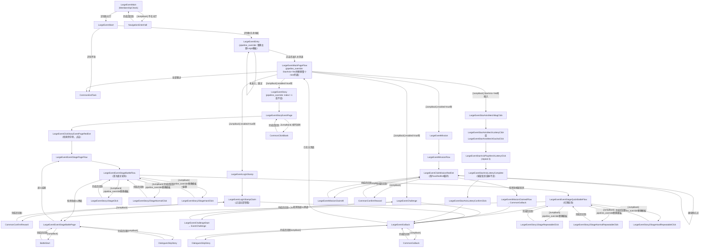

让我先读取所有LargeEvent相关的pipeline文件完整内容。

以下是完整的 LargeEvent MD 文档：

---

# LargeEvent 大活动 — 任务状态机 Benchmark

## 概述

大活动是一个多子任务的复合型任务，通过主页面轮询调度多个子任务（签到、挑战、剧情、任务，以及 StarAnis 主题专属的周边包包）。任务配置通过多层 `pipeline_override` 在运行时修改 pipeline 节点的行为，子任务之间通过 `[JumpBack]` 机制实现"执行完回来继续"的循环调度。

---

## 一、任务配置（Task JSON）

任务入口为 `LargeEventMain`，暴露三个顶层 option：`LargeEventTheme`（主题选择）、`LargeEventStoryPriority`（剧情优先级）、`LargeEventContent`（内容勾选）。选择 StarAnis 主题时，额外出现嵌套 option `LargeEventStarAnisMerchBagClick`。

**文件：`assets/tasks/LargeEvent.json`**

```json
{
    "task": [
        {
            "name": "LargeEvent",
            "label": "$task.LargeEvent.label",
            "entry": "LargeEventMain",
            "description": "$task.LargeEvent.description",
            "option": [
                "LargeEventTheme",
                "LargeEventStoryPriority",
                "LargeEventContent"
            ],
            "group": ["daily"]
        }
    ],
    "option": {
        "LargeEventTheme": {
            "type": "select",
            "default_case": "StarAnis",
            "label": "$option.LargeEventTheme.label",
            "cases": [
                {
                    "name": "StarAnis",
                    "label": "$option.LargeEventTheme.StarAnis",
                    "option": ["LargeEventStarAnisMerchBagClick"],
                    "pipeline_override": {
                        "LargeEventEntry": {
                            "recognition": { "param": { "template": ["LargeEvent/StarAnis/StarAnisLogo.png"] } }
                        },
                        "LargeEventStory1StageClick": {
                            "recognition": { "param": { "template": ["LargeEvent/StarAnis/StarAnisStory1Stage.png"] } }
                        },
                        "LargeEventStory2StageNormalClick": {
                            "recognition": { "param": { "template": ["LargeEvent/StarAnis/StarAnisStory2StageNormal.png"] } }
                        },
                        "LargeEventStory2StageHardClick": {
                            "recognition": { "param": { "template": ["LargeEvent/StarAnis/StarAnisStory2StageHard.png", "LargeEvent/StarAnis/StarAnisStory2StageHardSP.png"] } },
                            "action": { "param": { "target_offset": [70, -70, 0, 0] } }
                        },
                        "LargeEventStory1StageRepeatableClick": {
                            "recognition": { "param": { "template": ["LargeEvent/StarAnis/StarAnisStory1StageRepeatable.png"] } }
                        },
                        "LargeEventStory2StageNormalRepeatableClick": {
                            "recognition": { "param": { "template": ["LargeEvent/StarAnis/StarAnisStory2StageNormal.png"] } }
                        },
                        "LargeEventStory2StageHardRepeatableClick": {
                            "recognition": { "param": { "template": ["LargeEvent/StarAnis/StarAnisStory2StageHardRepeatable.png"] } }
                        }
                    }
                },
                { "name": "Other", "label": "$option.LargeEventTheme.Other" }
            ]
        },
        "LargeEventContent": {
            "type": "checkbox",
            "default_case": ["LargeEventLoginStamp", "LargeEventChallenge", "LargeEventStory", "LargeEventMission"],
            "label": "$option.LargeEventContent.label",
            "cases": [
                { "name": "LargeEventLoginStamp", "pipeline_override": { "LargeEventLoginStamp": { "enabled": true } } },
                { "name": "LargeEventChallenge",  "pipeline_override": { "LargeEventChallenge":  { "enabled": true } } },
                { "name": "LargeEventStory",      "pipeline_override": { "LargeEventStory":      { "enabled": true } } },
                { "name": "LargeEventMission",    "pipeline_override": { "LargeEventMission":    { "enabled": true } } }
            ]
        },
        "LargeEventStarAnisMerchBagClick": {
            "type": "switch",
            "default_case": "Yes",
            "label": "$option.LargeEventStarAnisMerchBagClick.label",
            "cases": [
                {
                    "name": "Yes",
                    "pipeline_override": {
                        "LargeEventMainPageFlow": {
                            "next": [
                                "[JumpBack]LargeEventLoginStamp",
                                "[JumpBack]LargeEventChallenge",
                                "[JumpBack]LargeEventStory",
                                "[JumpBack]LargeEventMission",
                                "[JumpBack]LargeEventStarAnisMerchBagClick",
                                "CommonEndTask"
                            ]
                        }
                    }
                },
                { "name": "No" }
            ]
        },
        "LargeEventStoryPriority": {
            "type": "select",
            "default_case": "Story2First",
            "label": "$option.LargeEventStoryPriority.label",
            "cases": [
                {
                    "name": "Story2First",
                    "pipeline_override": { "LargeEventStory": { "recognition": { "param": { "index": -1 } } } }
                },
                { "name": "Story1First" }
            ]
        }
    }
}
```

---

## 二、进入活动

任务启动后，程序执行会员资格检查（`MembershipCheck`）。然后检查当前是否在大厅界面（识别方舟导航栏是否可见）——如果不在，就先导航回大厅，导航完成后**回到 `LargeEventMain` 继续**（JumpBack `NavigationEnterHall`）。

确认在大厅后，程序在屏幕右下角（ROI: 824,571,145,68）寻找活动入口图标。

> **pipeline_override 生效**：程序认的图标图片取决于 `LargeEventTheme` 的选择。选了 StarAnis，就去认 `StarAnisLogo.png`；选了 Other，则认对应图片。此 override 修改的是 `LargeEventEntry` 节点的 `recognition.param.template`。

找到图标后点击，等待进入活动地区主页面（识别左上角出现"活动地区"字样，ROI: 2,11,82,30）。如果点击后还没进入，就继续重试 `LargeEventEntry`（`next` 中的自循环）。

**文件：`assets/resource/pipeline/Event/LargeEvent/LargeEvent.json`**

```json
{
    "LargeEventMain": {
        "desc": "大活动",
        "action": { "type": "Custom", "param": { "custom_action": "MembershipCheck" } },
        "next": [
            "LargeEventStart",
            "[JumpBack]NavigationEnterHall"
        ]
    },
    "LargeEventStart": {
        "desc": "大活动开始",
        "recognition": { "type": "And", "param": { "all_of": ["NavigationArkVisible"] } },
        "next": [
            "LargeEventEntry",
            "CommonEndTask"
        ]
    },
    "LargeEventEntry": {
        "desc": "大活动入口",
        "recognition": {
            "type": "TemplateMatch",
            "param": {
                "roi": [824, 571, 145, 68],
                "template": ["Common/RedDot.png"]  // 占位，由 pipeline_override 替换
            }
        },
        "action": { "type": "Click" },
        "next": [
            "LargeEventMainPageFlow",
            "LargeEventEntry"
        ]
    },
    "LargeEventMainPageEntered": {
        "desc": "已进入活动地区",
        "recognition": { "type": "OCR", "param": { "roi": [2, 11, 82, 30], "expected": [".*活动地.*"] } }
    }
}
```

---

## 三、活动地区主页面——轮询调度子任务

程序确认进入活动地区主页面后，等待页面中央区域（446,539,389,82）稳定 500ms，然后开始依次检查各个子任务。

> **JumpBack 核心逻辑**：`next` 列表中的每个 `[JumpBack]` 子任务，执行完成后会自动回到 `LargeEventMainPageFlow` 重新检查，继续找下一个需要执行的子任务。直到所有子任务都无事可做（均被跳过），才进入 `CommonEndTask` 结束。

> **pipeline_override 生效（两处）**：
> 1. `LargeEventContent` 的 checkbox 控制各子任务节点的 `enabled`。默认全部为 `false`，勾选后才变为 `true`，程序才真正执行该子任务，否则直接跳过。
> 2. 若选了 StarAnis 主题且 `LargeEventStarAnisMerchBagClick` 选 Yes，则整个 `next` 列表被替换，第 5 个 JumpBack（`LargeEventStarAnisMerchBagClick`）被插入。

**文件：`assets/resource/pipeline/Event/LargeEvent/LargeEvent.json`**

```json
{
    "LargeEventMainPageFlow": {
        "desc": "活动地区流程",
        "recognition": { "type": "And", "param": { "all_of": ["LargeEventMainPageEntered"] } },
        "pre_wait_freezes": { "time": 500, "target": [446, 539, 389, 82] },
        "action": "DoNothing",
        "next": [
            "[JumpBack]LargeEventLoginStamp",
            "[JumpBack]LargeEventChallenge",
            "[JumpBack]LargeEventStory",
            "[JumpBack]LargeEventMission",
            "CommonEndTask"
            // 若 StarAnis + MerchBagClick=Yes，pipeline_override 将此列表替换为含第5项的版本
        ]
    }
}
```

---

## 四、返回机制（贯穿全程）

每个子任务结束后都会进入 `LargeEventGoBack`。流程如下：

先检查是否已回到活动地区主页面（`LargeEventMainPageEntered`）——如果已经在了，直接结束返回，JumpBack 回到 `LargeEventMainPageFlow` 继续轮询。

如果还没回到主页面：
- 如果途中弹出剧情对话，就跳过，跳完**回到 `LargeEventGoBack` 继续**（JumpBack `DialoguesSkipStory`）
- 点击返回按钮，点完**回到 `LargeEventGoBack` 继续检查**（JumpBack `CommonGoBack`）
- 直到确认回到活动地区主页面为止

**文件：`assets/resource/pipeline/Event/LargeEvent/LargeEvent.json`**

```json
{
    "LargeEventGoBack": {
        "desc": "返回活动地区",
        "next": [
            "LargeEventMainPageEntered",
            "[JumpBack]DialoguesSkipStory",
            "[JumpBack]CommonGoBack"
        ]
    }
}
```

---

## 五、子任务 A：签到（LargeEventLoginStamp）

> **pipeline_override 生效**：`LargeEventLoginStamp` 节点默认 `enabled: false`。用户勾选"签到"后，override 将其改为 `enabled: true`，程序才会识别并点击"签到"标签。

程序在主页面底部找到"签到"标签（OCR 识别".*签到.*"，ROI: 485,536,308,79），点击进入签到页面。

进入签到页面后，找到"全部领取"按钮（OCR 识别"全部领取"，ROI: 651,649,162,37），点击，等待 1000ms。

如果弹出奖励确认窗口，就点击确认，确认完**回到 `LargeEventLoginStampClaim` 继续等**（JumpBack `CommonConfirmReward`），直到没有新的弹窗。

然后进入 `LargeEventGoBack` 返回活动地区主页面，**JumpBack 回到 `LargeEventMainPageFlow`** 继续检查下一个子任务。

**文件：`assets/resource/pipeline/Event/LargeEvent/LargeEventLoginStamp.json`**

```json
{
    "LargeEventLoginStamp": {
        "max_hit": 1,
        "timeout": 60000,
        "desc": "大活动签到",
        "enabled": false,  // 由 pipeline_override 改为 true
        "recognition": { "type": "OCR", "param": { "roi": [485, 536, 308, 79], "expected": [".*签到.*"] } },
        "action": { "type": "Click" },
        "next": ["LargeEventLoginStampClaim"]
    },
    "LargeEventLoginStampClaim": {
        "desc": "大活动签到奖励领取",
        "recognition": { "type": "OCR", "param": { "roi": [651, 649, 162, 37], "expected": ["全部领取"] } },
        "action": { "type": "Click" },
        "post_wait_freezes": 1000,
        "next": [
            "[JumpBack]CommonConfirmReward",
            "LargeEventGoBack"
        ]
    }
}
```

---

## 六、子任务 B：挑战（LargeEventChallenge）

> **pipeline_override 生效**：`LargeEventChallenge` 节点默认 `enabled: false`。用户勾选"挑战"后，override 将其改为 `enabled: true`。

程序在主页面底部找到"挑战"标签（OCR 识别".*挑战.*"，ROI: 485,536,308,79，含 OCR 纠错"排"→"挑"），点击进入挑战页面，等待 500ms。

进入挑战页面后，跳入 `LargeEventChallengeStart`，再进入共享的 `EventChallenge` 流程（见下方）。挑战完成后**回到 `LargeEventChallenge` 继续**（JumpBack `LargeEventChallengeStart`），确认完成。

然后进入 `LargeEventGoBack` 返回，**JumpBack 回到 `LargeEventMainPageFlow`**。

**文件：`assets/resource/pipeline/Event/LargeEvent/LargeEventChallenge.json`**

```json
{
    "LargeEventChallenge": {
        "max_hit": 1,
        "timeout": 60000,
        "desc": "大活动挑战",
        "enabled": false,  // 由 pipeline_override 改为 true
        "recognition": {
            "type": "OCR",
            "param": { "roi": [485, 536, 308, 79], "replace": [["排", "挑"]], "expected": [".*挑战.*"] }
        },
        "action": { "type": "Click" },
        "post_wait_freezes": 500,
        "next": [
            "[JumpBack]LargeEventChallengeStart",
            "LargeEventGoBack"
        ]
    },
    "LargeEventChallengeStart": {
        "max_hit": 1,
        "next": ["EventChallenge"]
    }
}
```

### 共享流程：EventChallenge

`EventChallenge` 是被 LargeEvent 和 SmallEvent 共用的挑战 pipeline。进入挑战关卡页面（识别左上角"挑战关卡"字样）后，等待 500ms，然后：

- 优先找标有"CHALLENGE"的未挑战关卡（从列表底部取，`index: -1`），找到就点击，点完**回到 `EventChallengeStage` 继续找**（自循环），直到没有未挑战关卡
- 如果没有未挑战关卡，找标有"CLEAR"的已通关关卡，点击，点完**回到 `EventClearStage` 继续找**（自循环）
- 找到关卡后进入 `BattleStart` 开始战斗

**文件：`assets/resource/pipeline/Event/Challenge/EventChallenge.json`**

```json
{
    "EventChallenge": {
        "desc": "活动挑战",
        "next": ["EventChallengeStagePage"]
    },
    "EventChallengeStagePage": {
        "desc": "活动挑战页面",
        "recognition": { "type": "And", "param": { "all_of": ["EventChallengeStageVisible"] } },
        "post_wait_freezes": 500,
        "next": ["EventChallengeStage", "EventClearStage"]
    },
    "EventChallengeStage": {
        "desc": "未挑战的关卡",
        "recognition": {
            "type": "OCR",
            "param": { "roi": [452, 253, 379, 424], "expected": ["(?i).*CHALLENGE.*"], "order_by": "Vertical", "index": -1 }
        },
        "action": { "type": "Click" },
        "post_wait_freezes": 500,
        "next": ["BattleStart", "EventChallengeStage"]
    },
    "EventClearStage": {
        "desc": "已挑战的关卡",
        "recognition": {
            "type": "OCR",
            "param": { "roi": [452, 253, 379, 424], "expected": [".*CLEAR.*"], "order_by": "Vertical", "index": -1 }
        },
        "action": { "type": "Click" },
        "post_wait_freezes": 500,
        "next": ["BattleStart", "EventClearStage"]
    },
    "EventChallengeStageVisible": {
        "desc": "活动挑战入口的标识",
        "recognition": { "type": "OCR", "param": { "roi": [5, 18, 50, 16], "expected": ["挑战关卡"] } }
    }
}
```

---

## 七、子任务 C：剧情（LargeEventStory）

> **pipeline_override 生效（三处叠加）**：
> 1. `LargeEventContent.LargeEventStory`：将 `LargeEventStory.enabled` 改为 `true`，程序才执行此子任务。
> 2. `LargeEventStoryPriority`：选 Story2First 时，将 `LargeEventStory` 的 `recognition.param.index` 改为 `-1`（从列表末尾取，即优先最新剧情）；选 Story1First 时不修改（默认从头取）。
> 3. `LargeEventTheme.StarAnis`：将 6 个关卡点击节点（`LargeEventStory1StageClick` 等）的 `recognition.param.template` 全部替换为 StarAnis 专属图片；Story2 困难关卡还额外修改 `action.param.target_offset` 为 [70,-70,0,0]。

### 7.1 进入剧情活动页面

程序在主页面底部找到"STORY"标签（OCR 识别".*STORY.*"，ROI: 485,536,308,79，按垂直顺序排列），点击进入剧情活动页面。

进入剧情活动页面后（识别左上角"剧情活动"字样），先点击屏幕左侧（150,650）确保焦点正确，等待页面中央区域（314,413,661,294）稳定 500ms。

然后在页面中央区域找到显示"剩余"字样的关卡入口（OCR 识别".*剩余.*"），点击（点击位置向上偏移 50 像素，即点关卡图片而非文字），等待 500ms，进入活动关卡页面。

如果找不到"剩余"字样（说明没有可打的关卡），就点击空白处等待（JumpBack `CommonClickBlank`），回来继续检查。

### 7.2 活动关卡页面——第一轮：首次通关

进入活动关卡页面（识别左上角"活动关"字样）后，等待关卡列表区域（494,505,294,131）稳定 500ms，进入 `LargeEventEventStageBattleFlow`。

程序在关卡列表中轮询三种首次通关关卡：

- 先检查是否已进入战斗页面（`LargeEventEventStageBattlePage`，识别 `BattleMainVisible`）——如果是，执行战斗（见 7.3）
- 找 Story1 关卡按钮（ROI: 314,103,661,604，从底部取 `index:-1`），找到就点击，等待 500ms，点完**回到 `LargeEventEventStageBattleFlow` 继续**（JumpBack `LargeEventStory1StageClick`）
- 找 Story2 普通关卡按钮，找到就点击，点完**回到这里继续**（JumpBack `LargeEventStory2StageNormalClick`）
- 找 Story2 困难关卡按钮，找到就点击（StarAnis 主题下点击位置偏移 [70,-70]），点完**回到这里继续**（JumpBack `LargeEventStory2StageHardClick`）

> 三个关卡点击节点均有 `max_hit: 1`，每个节点最多触发一次，避免重复点击同一关卡。

三种首次通关关卡都找不到了，进入第二轮。

### 7.3 战斗页面处理

进入战斗页面（识别 `BattleMainVisible`）后：

- 开始战斗，战斗结束后**回到 `LargeEventEventStageBattlePage` 继续等**（JumpBack `BattleStart`）
- 如果途中弹出剧情对话，就跳过，跳完**回到这里继续等**（JumpBack `DialoguesSkipStory`）
- 战斗彻底结束且无对话后，回到 `LargeEventEventStagePageFlow`（关卡列表页面）继续找下一个可打的关卡

### 7.4 活动关卡页面——第二轮：扫荡

同样先检查战斗页面，然后轮询三种可扫荡关卡：

- 找 Story1 可扫荡关卡，找到就点击，点完**回到 `LargeEventEventStageQuickBattleFlow` 继续**（JumpBack `LargeEventStory1StageRepeatableClick`）
- 找 Story2 普通可扫荡关卡，找到就点击，点完**回到这里继续**（JumpBack `LargeEventStory2StageNormalRepeatableClick`）
- 找 Story2 困难可扫荡关卡，找到就点击，点完**回到这里继续**（JumpBack `LargeEventStory2StageHardRepeatableClick`）

三种扫荡关卡都找不到了，进入 `LargeEventGoBack` 返回，**JumpBack 回到 `LargeEventMainPageFlow`**。

**文件：`assets/resource/pipeline/Event/LargeEvent/LargeEventStory.json`**

```json
{
    "LargeEventStory": {
        "timeout": 60000,
        "max_hit": 1,
        "desc": "大活动剧情",
        "enabled": false,  // 由 pipeline_override 改为 true
        "recognition": {
            "type": "OCR",
            "param": {
                "roi": [485, 536, 308, 79],
                "expected": [".*STORY.*"],
                "order_by": "Vertical"
                // Story2First 时 pipeline_override 追加 "index": -1
            }
        },
        "action": { "type": "Click" },
        "next": ["LargeEventStoryEventPage"]
    },
    "LargeEventStoryEventPage": {
        "desc": "大活动剧情活动页面",
        "recognition": { "type": "And", "param": { "all_of": ["LargeEventStoryVisible"] } },
        "action": { "type": "Click", "param": { "target": [150, 650] } },
        "post_wait_freezes": { "time": 500, "target": [314, 413, 661, 294] },
        "next": [
            "LargeEventClickStoryEventPageRedDot",
            "[JumpBack]CommonClickBlank"
        ]
    },
    "LargeEventClickStoryEventPageRedDot": {
        "desc": "大活动剧情活动页面的红点",
        "recognition": { "type": "OCR", "param": { "roi": [314, 413, 661, 294], "expected": [".*剩余.*"] } },
        "action": { "type": "Click", "param": { "target_offset": [0, -50, 0, 0] } },
        "post_wait_freezes": 500,
        "next": ["LargeEventEventStagePageFlow"]
    },
    "LargeEventEventStagePageEntered": {
        "desc": "已进入大活动活动关卡页面",
        "recognition": { "type": "OCR", "param": { "roi": [5, 18, 50, 16], "expected": [".*活动关.*"] } }
    },
    "LargeEventEventStagePageFlow": {
        "desc": "大活动活动关卡页面流程",
        "recognition": { "type": "And", "param": { "all_of": ["LargeEventEventStagePageEntered"] } },
        "post_wait_freezes": { "time": 500, "target": [494, 505, 294, 131] },
        "next": ["LargeEventEventStageBattleFlow"]
    },
    "LargeEventEventStageBattleFlow": {
        "desc": "大活动活动关卡页面战斗流程（首次通关）",
        "next": [
            "LargeEventEventStageBattlePage",
            "[JumpBack]LargeEventStory1StageClick",
            "[JumpBack]LargeEventStory2StageNormalClick",
            "[JumpBack]LargeEventStory2StageHardClick",
            "LargeEventEventStageQuickBattleFlow"
        ]
    },
    "LargeEventEventStageQuickBattleFlow": {
        "desc": "大活动活动关卡页面快速战斗流程（扫荡）",
        "next": [
            "LargeEventEventStageBattlePage",
            "[JumpBack]LargeEventStory1StageRepeatableClick",
            "[JumpBack]LargeEventStory2StageNormalRepeatableClick",
            "[JumpBack]LargeEventStory2StageHardRepeatableClick",
            "LargeEventGoBack"
        ]
    },
    "LargeEventEventStageBattlePage": {
        "desc": "大活动活动关卡页面战斗页面",
        "recognition": { "type": "And", "param": { "all_of": ["BattleMainVisible"] } },
        "next": [
            "[JumpBack]BattleStart",
            "LargeEventEventStagePageFlow",
            "[JumpBack]DialoguesSkipStory",
            "LargeEventGoBack"
        ]
    },
    "LargeEventStoryVisible": {
        "desc": "大活动剧情活动页面标识",
        "recognition": { "type": "OCR", "param": { "roi": [5, 18, 50, 16], "expected": ["剧情活动"] } }
    },
    "LargeEventStory1StageClick": {
        "desc": "大活动故事1关卡点击",
        "max_hit": 1,
        "recognition": {
            "type": "TemplateMatch",
            "param": {
                "roi": [314, 103, 661, 604],
                "template": ["Common/RedDot.png"],  // StarAnis 时 override 为 StarAnisStory1Stage.png
                "order_by": "Vertical", "index": -1
            }
        },
        "action": { "type": "Click" },
        "post_wait_freezes": 500
    },
    "LargeEventStory2StageNormalClick": {
        "desc": "大活动故事2普通关卡点击",
        "max_hit": 1,
        "recognition": {
            "type": "TemplateMatch",
            "param": {
                "roi": [314, 103, 661, 604],
                "template": ["Common/RedDot.png"],  // StarAnis 时 override 为 StarAnisStory2StageNormal.png
                "order_by": "Vertical", "index": -1
            }
        },
        "action": { "type": "Click" },
        "post_wait_freezes": 500
    },
    "LargeEventStory2StageHardClick": {
        "desc": "大活动故事2困难关卡点击",
        "max_hit": 1,
        "recognition": {
            "type": "TemplateMatch",
            "param": {
                "roi": [314, 103, 661, 604],
                "template": ["Common/RedDot.png"],  // StarAnis 时 override 为 StarAnisStory2StageHard.png
                "order_by": "Vertical", "index": -1
            }
        },
        "action": { "type": "Click" },
        // StarAnis 时 pipeline_override 追加 "action.param.target_offset": [70, -70, 0, 0]
        "post_wait_freezes": 500
    },
    "LargeEventStory1StageRepeatableClick": { /* 同上，template 由 StarAnis override 替换 */ },
    "LargeEventStory2StageNormalRepeatableClick": { /* 同上 */ },
    "LargeEventStory2StageHardRepeatableClick": { /* 同上 */ }
}
```

---

## 八、子任务 D：任务（LargeEventMission）

> **pipeline_override 生效**：`LargeEventMission` 节点默认 `enabled: false`。用户勾选"任务"后，override 将其改为 `enabled: true`。

程序在屏幕右侧（ROI: 1250,112,30,107）找到有红点的任务按钮，点击（点击位置向左 10、向下 10 像素），进入任务面板。

确认任务面板已打开（识别".*全部.*"字样，ROI: 680,624,137,35），进入 `LargeEventClickMissionRedDot` 循环：

- 在面板内（ROI: 453,106,375,59）找有红点（`PassRedDot.png`）的任务，点击（向左 10、向下 10 像素）
- 点击"全部领取"按钮（OCR 识别".*全部.*"，ROI: 680,624,137,35），点完**回到 `LargeEventClickMissionRedDot` 继续**（JumpBack `LargeEventMissionClaimAll`）
- 如果弹出奖励确认窗口，点击确认，确认完**回到这里继续**（JumpBack `CommonConfirmReward`）
- 回到 `LargeEventClickMissionRedDot` 继续找下一个有红点的任务

如果发现"全部领取"按钮颜色变为灰色（RGB 180~220，像素数 ≥ 100，说明全部领完），进入 `LargeEventMissionClaimedFlow`，直接调用 `CommonGoBack` 退出任务面板，**JumpBack 回到 `LargeEventMainPageFlow`**。

**文件：`assets/resource/pipeline/Event/LargeEvent/LargeEventMission.json`**

```json
{
    "LargeEventMission": {
        "max_hit": 1,
        "timeout": 60000,
        "desc": "大活动任务",
        "enabled": false,  // 由 pipeline_override 改为 true
        "recognition": {
            "type": "TemplateMatch",
            "param": { "roi": [1250, 112, 30, 107], "template": ["Common/RedDot.png"] }
        },
        "action": { "type": "Click", "param": { "target_offset": [-10, 10, 0, 0] } },
        "next": ["LargeEventMissionFlow"]
    },
    "LargeEventMissionVisible": {
        "desc": "大活动任务内部的标识",
        "recognition": { "type": "OCR", "param": { "roi": [680, 624, 137, 35], "expected": [".*全部.*"] } }
    },
    "LargeEventMissionFlow": {
        "desc": "大活动任务流程",
        "recognition": { "type": "And", "param": { "all_of": ["LargeEventMissionVisible"] } },
        "next": ["LargeEventClickMissionRedDot"]
    },
    "LargeEventClickMissionRedDot": {
        "desc": "大活动任务的红点",
        "recognition": {
            "type": "TemplateMatch",
            "param": { "roi": [453, 106, 375, 59], "template": ["Common/PassRedDot.png"] }
        },
        "action": { "type": "Click", "param": { "target_offset": [-10, 10, 0, 0] } },
        "next": [
            "LargeEventMissionClaimedFlow",
            "[JumpBack]LargeEventMissionClaimAll",
            "[JumpBack]CommonConfirmReward",
            "LargeEventClickMissionRedDot"
        ]
    },
    "LargeEventMissionClaimed": {
        "desc": "大活动任务奖励已领取（按钮变灰）",
        "recognition": {
            "type": "ColorMatch",
            "param": { "roi": [680, 624, 137, 35], "lower": [180, 180, 180], "upper": [220, 220, 220], "count": 100 }
        }
    },
    "LargeEventMissionClaimedFlow": {
        "desc": "大活动任务奖励已领取流程",
        "recognition": { "type": "And", "param": { "all_of": ["LargeEventMissionClaimed"] } },
        "next": ["CommonGoBack"]
    },
    "LargeEventMissionClaimAll": {
        "desc": "大活动任务奖励领取",
        "recognition": { "type": "OCR", "param": { "roi": [680, 624, 137, 35], "expected": [".*全部.*"] } },
        "action": { "type": "Click" }
    }
}
```

---

## 九、子任务 E：StarAnis 周边包包（LargeEventStarAnisMerchBagClick）

> **pipeline_override 生效（此子任务本身由 override 插入）**：此子任务能出现在 `LargeEventMainPageFlow` 的轮询列表中，本身就是 `LargeEventStarAnisMerchBagClick=Yes` 的 pipeline_override 将整个 `next` 列表替换的结果。若选 No，则此节点不在轮询列表中，永远不会被执行。

程序在主页面右上角找到"周边包包"文字（OCR，ROI: 1208,130,63,21），点击进入，等待 1000ms。

进入后，程序检查两种入口：

**情况 A：有"抽取刮刮乐周边"按钮**（OCR，ROI: 681,417,106,102）

点击后，检查是否已完成（`LargeEventStarAnisLotteryComplete`）：
- 如果抽取按钮变灰（颜色检测，ROI: 646,488,149,37，RGB 100~180，像素数 ≥ 4000）或出现"不足"字样（OCR，ROI: 542,343,188,33），说明次数耗尽或券不足，进入完成流程
- 否则找到"抽取"按钮（OCR，ROI: 589,515,101,29），点击 3 次（`repeat: 3`，每次间隔 500ms），点完后再次检查是否完成，或回到 `LargeEventStarAnisMerchLotteryClick` 继续

完成后，如果有确认按钮（`ConfirmWithCircle.png`，ROI: 489,490,36,33），点击确认，然后进入 `LargeEventGoBack` 返回。

**情况 B：有"抽取周边"按钮**（OCR，ROI: 1212,166,58,21）

点击后等待 500ms，检查：
- 如果抽取按钮变灰，说明次数耗尽，进入完成流程
- 否则找到"抽取"按钮，点击 3 次，点完后继续检查
- 如果两者都没有，直接进入 `LargeEventGoBack` 返回

完成后进入 `LargeEventGoBack` 返回，**JumpBack 回到 `LargeEventMainPageFlow`**。

**文件：`assets/resource/pipeline/Event/LargeEvent/StarAnis.json`**

```json
{
    "LargeEventStarAnisMerchBagClick": {
        "desc": "点击周边包包",
        "recognition": { "type": "OCR", "param": { "roi": [1208, 130, 63, 21], "expected": ["周边包包"] } },
        "action": { "type": "Click" },
        "post_wait_freezes": 1000,
        "next": [
            "LargeEventStarAnisMerchLotteryClick",
            "LargeEventStarAnisMerchGachaClick"
        ]
    },
    "LargeEventStarAnisMerchLotteryClick": {
        "desc": "点击抽取刮刮乐周边",
        "recognition": { "type": "OCR", "param": { "roi": [681, 417, 106, 102], "expected": ["抽取刮刮乐周边"] } },
        "action": { "type": "Click" },
        "next": [
            "LargeEventStarAnisLotteryComplete",
            "LargeEventStarAnisPlayMerchLotteryClick",
            "LargeEventStarAnisMerchLotteryClick"
        ]
    },
    "LargeEventStarAnisMerchGachaClick": {
        "desc": "点击抽取周边",
        "recognition": { "type": "OCR", "param": { "roi": [1212, 166, 58, 21], "expected": ["抽取周边"] } },
        "action": { "type": "Click" },
        "post_wait_freezes": 500,
        "next": [
            "LargeEventStarAnisLotteryGrayButtonVisible",
            "LargeEventStarAnisPlayMerchLotteryClick",
            "LargeEventGoBack"
        ]
    },
    "LargeEventStarAnisPlayMerchLotteryClick": {
        "desc": "点击画面进行抽取",
        "recognition": { "type": "OCR", "param": { "roi": [589, 515, 101, 29], "expected": [".*抽取.*"] } },
        "action": { "type": "Click" },
        "repeat": 3,
        "repeat_delay": 500,
        "next": [
            "LargeEventStarAnisLotteryComplete",
            "LargeEventStarAnisMerchLotteryClick",
            "LargeEventStarAnisPlayMerchLotteryClick"
        ]
    },
    "LargeEventStarAnisLotteryComplete": {
        "desc": "抽取次数耗尽（按钮变灰或券不足）",
        "recognition": {
            "type": "Or",
            "param": { "any_of": ["LargeEventStarAnisLotteryGrayButtonVisible", "LargeEventStarAnisLotteryRunOut"] }
        },
        "next": [
            "LargeEventStarAnisLotteryConfirmClick",
            "LargeEventGoBack"
        ]
    },
    "LargeEventStarAnisLotteryConfirmClick": {
        "desc": "确认抽取结果",
        "recognition": {
            "type": "TemplateMatch",
            "param": { "roi": [489, 490, 36, 33], "template": ["Common/ConfirmWithCircle.png"] }
        },
        "action": { "type": "Click" },
        "next": ["LargeEventGoBack"]
    },
    "LargeEventStarAnisLotteryGrayButtonVisible": {
        "desc": "抽取按钮变灰",
        "recognition": {
            "type": "ColorMatch",
            "param": { "roi": [646, 488, 149, 37], "lower": [100, 100, 100], "upper": [180, 180, 180], "count": 4000 }
        }
    },
    "LargeEventStarAnisLotteryRunOut": {
        "desc": "抽奖券不足",
        "recognition": { "type": "OCR", "param": { "roi": [542, 343, 188, 33], "expected": [".*不足.*"] } }
    }
}
```

---

## 十、完整状态转移图

