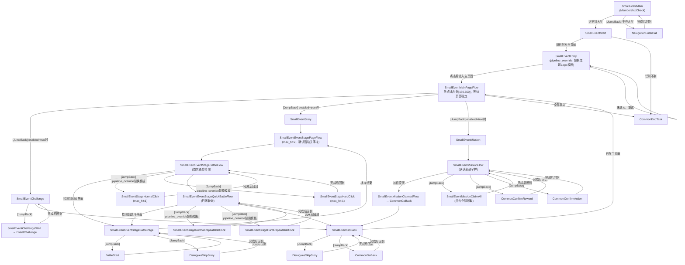

让我先读取所有 SmallEvent 相关的 pipeline 文件完整内容。

以下是完整的 SmallEvent MD 文档：

---

# SmallEvent 小活动 — 任务状态机 Benchmark

## 概述

小活动是大活动（LargeEvent）的精简版，同样通过主页面轮询调度三个子任务（挑战、剧情、任务），通过 `pipeline_override` 在运行时替换主题图片和控制子任务开关，通过 `[JumpBack]` 实现"执行完回来继续"的循环调度。与 LargeEvent 相比，没有签到子任务、没有主题专属子任务、没有剧情优先级配置，剧情子流程也更简洁。

---

## 一、任务配置（Task JSON）

任务入口为 `SmallEventMain`，暴露两个顶层 option：`SmallEventTheme`（主题选择）和 `SmallEventContent`（内容勾选）。

**文件：`assets/tasks/SmallEvent.json`**

```json
{
    "task": [
        {
            "name": "SmallEvent",
            "label": "$task.SmallEvent.label",
            "entry": "SmallEventMain",
            "description": "$task.SmallEvent.description",
            "option": [
                "SmallEventTheme",
                "SmallEventContent"
            ],
            "group": ["daily"]
        }
    ],
    "option": {
        "SmallEventTheme": {
            "type": "select",
            "default_case": "BSideIdol",
            "label": "$option.SmallEventTheme.label",
            "cases": [
                {
                    "name": "BSideIdol",
                    "label": "$option.SmallEventTheme.BSideIdol",
                    "pipeline_override": {
                        "SmallEventEntry": {
                            "recognition": { "param": { "template": ["SmallEvent/B-SideIdol/B-SideIdolLogo.png"] } }
                        },
                        "SmallEventStageNormalClick": {
                            "recognition": { "param": { "template": ["SmallEvent/B-SideIdol/B-SideIdolStageNormal.png"] } }
                        },
                        "SmallEventStageHardClick": {
                            "recognition": { "param": { "template": ["SmallEvent/B-SideIdol/B-SideIdolStageHard.png"] } }
                        },
                        "SmallEventStageNormalRepeatableClick": {
                            "recognition": { "param": { "template": ["SmallEvent/B-SideIdol/B-SideIdolStageNormalRepeatable.png"] } }
                        },
                        "SmallEventStageHardRepeatableClick": {
                            "recognition": { "param": { "template": ["SmallEvent/B-SideIdol/B-SideIdolStageHardRepeatable.png"] } }
                        }
                    }
                },
                { "name": "Other", "label": "$option.SmallEventTheme.Other" }
            ]
        },
        "SmallEventContent": {
            "type": "checkbox",
            "default_case": ["SmallEventChallenge", "SmallEventStory", "SmallEventMission"],
            "label": "$option.SmallEventContent.label",
            "cases": [
                {
                    "name": "SmallEventChallenge",
                    "label": "$option.SmallEventContent.SmallEventChallenge",
                    "pipeline_override": { "SmallEventChallenge": { "enabled": true } }
                },
                {
                    "name": "SmallEventStory",
                    "label": "$option.SmallEventContent.SmallEventStory",
                    "pipeline_override": { "SmallEventStory": { "enabled": true } }
                },
                {
                    "name": "SmallEventMission",
                    "label": "$option.SmallEventContent.SmallEventMission",
                    "pipeline_override": { "SmallEventMission": { "enabled": true } }
                }
            ]
        }
    }
}
``` [1](#9-0) 

---

## 二、进入活动

任务启动后，程序先执行会员资格检查（`MembershipCheck`）。然后检查当前是否在大厅界面——如果不在，就先导航回大厅，导航完成后**回到这里继续**（JumpBack `NavigationEnterHall`）。

确认方舟导航可见（即在大厅）后，程序在屏幕右下角（roi: 824,571,145,68）寻找活动入口图标。

> **此处 pipeline_override 生效**：程序认的图标图片取决于用户选择的主题。选了 B-Side Idol，就去认 `B-SideIdolLogo.png`；选了 Other，则认对应图片（需在 task 页面配置）。

找到图标后点击，等待进入剧情活动主页面。如果点击后还没进入主页面，就继续重试 `SmallEventEntry`。

**文件：`assets/resource/pipeline/Event/SmallEvent/SmallEvent.json`（节点 SmallEventMain / SmallEventStart / SmallEventEntry）**

```json
{
    "SmallEventMain": {
        "desc": "小活动",
        "action": { "type": "Custom", "param": { "custom_action": "MembershipCheck" } },
        "next": [
            "SmallEventStart",
            "[JumpBack]NavigationEnterHall"
        ]
    },
    "SmallEventStart": {
        "desc": "小活动开始",
        "recognition": { "type": "And", "param": { "all_of": ["NavigationArkVisible"] } },
        "next": [
            "SmallEventEntry",
            "CommonEndTask"
        ]
    },
    "SmallEventEntry": {
        "desc": "小活动入口",
        "recognition": {
            "type": "TemplateMatch",
            "param": {
                "roi": [824, 571, 145, 68],
                "template": ["Common/RedDot.png"]  // 占位，pipeline_override 替换
            }
        },
        "action": { "type": "Click" },
        "next": [
            "SmallEventMainPageFlow",
            "SmallEventEntry"
        ]
    }
}
``` [2](#9-1) 

---

## 三、剧情活动主页面——轮询调度子任务

程序确认左上角出现"剧情"字样（`SmallEventMainPageEntered`），然后先点击一下屏幕左侧固定位置（坐标 150,650），再等待页面中央区域（446,539,389,82）稳定 500ms，确保页面焦点和状态正确。

之后开始依次检查各个子任务：

> **此处 JumpBack 的核心逻辑**：主页面不是走完一遍就结束，而是每次执行完一个子任务后，**自动回到这里重新检查**，继续找下一个需要执行的子任务，直到所有子任务都无事可做，才进入 `CommonEndTask` 结束。

> **此处 pipeline_override 生效**：挑战、剧情、任务三个子任务默认全部 `enabled: false`。只有用户在配置中勾选了某项，pipeline_override 才将该节点的 `enabled` 改为 `true`，程序才真正去执行它；否则直接跳过。

**文件：`assets/resource/pipeline/Event/SmallEvent/SmallEvent.json`（节点 SmallEventMainPageEntered / SmallEventMainPageFlow / SmallEventGoBack）**

```json
{
    "SmallEventMainPageEntered": {
        "desc": "已进入剧情活动",
        "recognition": {
            "type": "OCR",
            "param": { "roi": [2, 11, 82, 30], "expected": [".*剧情.*"] }
        }
    },
    "SmallEventMainPageFlow": {
        "desc": "活动地区流程",
        "recognition": { "type": "And", "param": { "all_of": ["SmallEventMainPageEntered"] } },
        "action": { "type": "Click", "param": { "target": [150, 650] } },
        "post_wait_freezes": { "time": 500, "target": [446, 539, 389, 82] },
        "next": [
            "[JumpBack]SmallEventChallenge",
            "[JumpBack]SmallEventStory",
            "[JumpBack]SmallEventMission",
            "CommonEndTask"
        ]
    },
    "SmallEventGoBack": {
        "desc": "返回剧情活动页面",
        "next": [
            "SmallEventMainPageEntered",
            "[JumpBack]DialoguesSkipStory",
            "[JumpBack]CommonGoBack"
        ]
    }
}
``` [3](#9-2) 

---

## 四、挑战子任务

程序在主页面中找到包含"挑战"字样的标签（roi: 485,536,308,79，OCR 会将"排"纠正为"挑"），点击进入挑战页面，等待 500ms 稳定。

然后跳入挑战流程（`[JumpBack]SmallEventChallengeStart → EventChallenge`），执行完成后**回到这里继续**（JumpBack）。

> **此处复用 LargeEvent**：`SmallEventChallengeStart` 直接跳入共享的 `EventChallenge` pipeline。进入挑战关卡页面后，程序找标有"CHALLENGE"的未挑战关卡点击进入战斗；没有则找标有"CLEAR"的已通关关卡；战斗结束后回到关卡列表继续，直到没有可打的关卡。

挑战完成后进入 `SmallEventGoBack` 返回，**JumpBack 回到 `SmallEventMainPageFlow`**。

**文件：`assets/resource/pipeline/Event/SmallEvent/SmallEventChallenge.json`**

```json
{
    "SmallEventChallenge": {
        "max_hit": 1,
        "timeout": 60000,
        "desc": "小活动挑战",
        "enabled": false,   // pipeline_override 将其改为 true 才执行
        "recognition": {
            "type": "OCR",
            "param": {
                "roi": [485, 536, 308, 79],
                "replace": [["排", "挑"]],
                "expected": [".*挑战.*"]
            }
        },
        "action": { "type": "Click" },
        "post_wait_freezes": 500,
        "next": [
            "[JumpBack]SmallEventChallengeStart",
            "SmallEventGoBack"
        ]
    },
    "SmallEventChallengeStart": {
        "max_hit": 1,
        "next": ["EventChallenge"]
    }
}
```

**共享文件：`assets/resource/pipeline/Event/Challenge/EventChallenge.json`**

```json
{
    "EventChallenge": {
        "desc": "活动挑战",
        "next": ["EventChallengeStagePage"]
    },
    "EventChallengeStagePage": {
        "desc": "活动挑战页面",
        "recognition": { "type": "And", "param": { "all_of": ["EventChallengeStageVisible"] } },
        "post_wait_freezes": 500,
        "next": ["EventChallengeStage", "EventClearStage"]
    },
    "EventChallengeStage": {
        "desc": "未挑战的关卡",
        "recognition": {
            "type": "OCR",
            "param": { "roi": [452, 253, 379, 424], "expected": ["(?i).*CHALLENGE.*"], "order_by": "Vertical", "index": -1 }
        },
        "action": { "type": "Click" },
        "post_wait_freezes": 500,
        "next": ["BattleStart", "EventChallengeStage"]
    },
    "EventClearStage": {
        "desc": "已挑战的关卡",
        "recognition": {
            "type": "OCR",
            "param": { "roi": [452, 253, 379, 424], "expected": [".*CLEAR.*"], "order_by": "Vertical", "index": -1 }
        },
        "action": { "type": "Click" },
        "post_wait_freezes": 500,
        "next": ["BattleStart", "EventClearStage"]
    },
    "EventChallengeStageVisible": {
        "desc": "活动挑战入口的标识",
        "recognition": { "type": "OCR", "param": { "roi": [5, 18, 50, 16], "expected": ["挑战关卡"] } }
    }
}
``` [4](#9-3) [5](#9-4) 

---

## 五、剧情子任务

程序在主页面中找到包含"加成"字样的关卡入口（roi: 314,413,661,294），点击（点击位置向上偏移 50 像素，即点击关卡图片区域而非文字），等待 500ms 稳定，直接进入关卡列表页面。

> **注意**：SmallEvent 没有 LargeEvent 中的"剧情活动页面"和"点击红点"中间步骤，找到"加成"字样后直接进入关卡列表。

进入关卡列表页面后，确认左上角出现"活动关"字样（`SmallEventEventStagePageEntered`），等待页面中央区域（494,505,294,131）稳定 500ms。此节点 `max_hit: 2`，即最多被命中 2 次（首次通关和扫荡各进入一次）。

**第一轮：首次通关**

程序在关卡列表中轮询两种首次通关关卡：

- 找普通关卡按钮（`[JumpBack]SmallEventStageNormalClick`），找到就点击，点完**回到这里继续找**（JumpBack）
- 找困难关卡按钮（`[JumpBack]SmallEventStageHardClick`），找到就点击，点完**回到这里继续找**（JumpBack）

> **此处 pipeline_override 生效**：程序认的关卡按钮图片取决于主题。选了 B-Side Idol，就去认 `B-SideIdolStageNormal.png` 和 `B-SideIdolStageHard.png`；选了 Other，则认对应图片。两个关卡点击节点均为 `max_hit: 1`，每轮最多点击一次。

如果进入了战斗页面（检测到 `BattleMainVisible`）：

> **此处复用 LargeEvent**：`[JumpBack]BattleStart`、`[JumpBack]DialoguesSkipStory`、`BattleMainVisible` 三个节点与 LargeEvent 完全相同。

- 开始战斗，战斗结束后**回到战斗页面继续等**（JumpBack `BattleStart`）
- 如果途中弹出剧情对话，就跳过，跳完**回到战斗页面继续等**（JumpBack `DialoguesSkipStory`）
- 战斗彻底结束后，回到关卡列表页面（`SmallEventEventStagePageFlow`）继续找下一个可打的关卡

两种首次通关关卡都找不到了，进入第二轮。

**第二轮：扫荡**

同样轮询两种可扫荡关卡（普通可扫荡、困难可扫荡），每找到一个就点击，点完**回到这里继续找**（JumpBack）。

> **此处 pipeline_override 生效**：扫荡关卡的图片同样被主题替换（`B-SideIdolStageNormalRepeatable.png`、`B-SideIdolStageHardRepeatable.png`）。

两种扫荡关卡也都找不到了，进入 `SmallEventGoBack` 返回，**JumpBack 回到 `SmallEventMainPageFlow`**。

**文件：`assets/resource/pipeline/Event/SmallEvent/SmallEventStory.json`**

```json
{
    "SmallEventStory": {
        "timeout": 60000,
        "max_hit": 1,
        "desc": "小活动剧情",
        "enabled": false,   // pipeline_override 将其改为 true 才执行
        "recognition": {
            "type": "OCR",
            "param": { "roi": [314, 413, 661, 294], "expected": [".*加成.*"] }
        },
        "action": { "type": "Click", "param": { "target_offset": [0, -50, 0, 0] } },
        "post_wait_freezes": 500,
        "next": ["SmallEventEventStagePageFlow"]
    },
    "SmallEventEventStagePageEntered": {
        "desc": "已进入小活动活动关卡页面",
        "recognition": { "type": "OCR", "param": { "roi": [5, 18, 50, 16], "expected": [".*活动关.*"] } }
    },
    "SmallEventEventStagePageFlow": {
        "desc": "小活动活动关卡页面流程",
        "max_hit": 2,
        "recognition": { "type": "And", "param": { "all_of": ["SmallEventEventStagePageEntered"] } },
        "post_wait_freezes": { "time": 500, "target": [494, 505, 294, 131] },
        "next": ["SmallEventEventStageBattleFlow"]
    },
    "SmallEventEventStageBattleFlow": {
        "desc": "小活动活动关卡页面战斗流程",
        "next": [
            "SmallEventEventStageBattlePage",
            "[JumpBack]SmallEventStageNormalClick",
            "[JumpBack]SmallEventStageHardClick",
            "SmallEventEventStageQuickBattleFlow"
        ]
    },
    "SmallEventEventStageQuickBattleFlow": {
        "desc": "小活动活动关卡页面快速战斗流程",
        "next": [
            "SmallEventEventStageBattlePage",
            "[JumpBack]SmallEventStageNormalRepeatableClick",
            "[JumpBack]SmallEventStageHardRepeatableClick",
            "SmallEventGoBack"
        ]
    },
    "SmallEventEventStageBattlePage": {
        "desc": "小活动活动关卡页面战斗页面",
        "recognition": { "type": "And", "param": { "all_of": ["BattleMainVisible"] } },
        "next": [
            "[JumpBack]BattleStart",
            "SmallEventEventStagePageFlow",
            "[JumpBack]DialoguesSkipStory",
            "SmallEventGoBack"
        ]
    },
    "SmallEventStageNormalClick": {
        "desc": "小活动普通关卡点击",
        "max_hit": 1,
        "recognition": {
            "type": "TemplateMatch",
            "param": {
                "roi": [314, 103, 661, 604],
                "template": ["Common/RedDot.png"],  // 占位，pipeline_override 替换
                "order_by": "Vertical",
                "index": -1
            }
        },
        "action": { "type": "Click" },
        "post_wait_freezes": 500
    },
    "SmallEventStageHardClick": {
        "desc": "小活动困难关卡点击",
        "max_hit": 1,
        "recognition": {
            "type": "TemplateMatch",
            "param": {
                "roi": [314, 103, 661, 604],
                "template": ["Common/RedDot.png"],  // 占位，pipeline_override 替换
                "order_by": "Vertical",
                "index": -1
            }
        },
        "action": { "type": "Click" },
        "post_wait_freezes": 500
    },
    "SmallEventStageNormalRepeatableClick": {
        "desc": "小活动普通关卡可扫荡点击",
        "recognition": {
            "type": "TemplateMatch",
            "param": {
                "roi": [314, 103, 661, 604],
                "template": ["Common/RedDot.png"],  // 占位，pipeline_override 替换
                "order_by": "Vertical",
                "index": -1
            }
        },
        "action": { "type": "Click" },
        "post_wait_freezes": 500
    },
    "SmallEventStageHardRepeatableClick": {
        "desc": "小活动困难关卡可扫荡点击",
        "recognition": {
            "type": "TemplateMatch",
            "param": {
                "roi": [314, 103, 661, 604],
                "template": ["Common/RedDot.png"],  // 占位，pipeline_override 替换
                "order_by": "Vertical",
                "index": -1
            }
        },
        "action": { "type": "Click" },
        "post_wait_freezes": 500
    }
}
``` [6](#9-5) 

---

## 六、任务子任务

程序在主页面中找到包含"任务"字样的入口（roi: 314,413,661,294），点击打开任务面板。

确认面板内出现"全部"字样（`SmallEventMissionVisible`，roi: 680,624,137,35）后，进入循环：

- 先检查"全部领取"按钮是否已变灰（`SmallEventMissionClaimed`，颜色检测 RGB 105~122 的灰色，像素数 ≥ 100）——如果变灰，说明全部领完，直接调用 `CommonGoBack` 退出任务面板，**JumpBack 回到 `SmallEventMainPageFlow`**
- 否则，点击"全部领取"按钮（`[JumpBack]SmallEventMissionClaimAll`），点完**回到这里继续**（JumpBack）
- 如果弹出奖励确认窗口，点击确认（`[JumpBack]CommonConfirmReward`），确认完**回到这里继续**（JumpBack）
- 如果弹出操作确认窗口，点击确认（`[JumpBack]CommonConfirmAction`），确认完**回到这里继续**（JumpBack）

> **此处复用 LargeEvent**：`[JumpBack]CommonConfirmReward` 和 `CommonGoBack` 节点与 LargeEvent 完全相同。SmallEvent 比 LargeEvent 多了一个 `[JumpBack]CommonConfirmAction`，用于处理额外的操作确认弹窗。

**文件：`assets/resource/pipeline/Event/SmallEvent/SmallEventMission.json`**

```json
{
    "SmallEventMission": {
        "max_hit": 1,
        "timeout": 60000,
        "desc": "小活动任务",
        "enabled": false,   // pipeline_override 将其改为 true 才执行
        "recognition": {
            "type": "OCR",
            "param": { "roi": [314, 413, 661, 294], "expected": [".*任务.*"] }
        },
        "action": { "type": "Click" },
        "next": ["SmallEventMissionFlow"]
    },
    "SmallEventMissionVisible": {
        "desc": "小活动任务内部的标识",
        "recognition": { "type": "OCR", "param": { "roi": [680, 624, 137, 35], "expected": [".*全部.*"] } }
    },
    "SmallEventMissionFlow": {
        "desc": "小活动任务流程",
        "recognition": { "type": "And", "param": { "all_of": ["SmallEventMissionVisible"] } },
        "next": [
            "SmallEventMissionClaimedFlow",
            "[JumpBack]SmallEventMissionClaimAll",
            "[JumpBack]CommonConfirmReward",
            "[JumpBack]CommonConfirmAction"
        ]
    },
    "SmallEventMissionClaimed": {
        "desc": "小活动任务奖励已领取",
        "recognition": {
            "type": "ColorMatch",
            "param": {
                "roi": [680, 624, 137, 35],
                "lower": [105, 105, 105],
                "upper": [122, 122, 122],
                "count": 100
            }
        }
    },
    "SmallEventMissionClaimedFlow": {
        "desc": "小活动任务奖励已领取流程",
        "recognition": { "type": "And", "param": { "all_of": ["SmallEventMissionClaimed"] } },
        "next": ["CommonGoBack"]
    },
    "SmallEventMissionClaimAll": {
        "desc": "小活动任务奖励领取",
        "recognition": { "type": "OCR", "param": { "roi": [680, 624, 137, 35], "expected": [".*全部.*"] } },
        "action": { "type": "Click" }
    }
}
``` [7](#9-6) 

---

## 七、返回机制（贯穿全程）

每个子任务结束后都会进入 `SmallEventGoBack`：

先检查是否已回到剧情活动主页面（`SmallEventMainPageEntered`）——如果已经在了，直接结束返回，**JumpBack 回到 `SmallEventMainPageFlow`**。

如果还没回到主页面：
- 如果途中弹出剧情对话，就跳过，跳完**回到这里继续返回**（JumpBack `DialoguesSkipStory`）
- 点击返回按钮，点完**回到这里继续检查**（JumpBack `CommonGoBack`）
- 直到确认回到剧情活动主页面为止

> **此处复用 LargeEvent**：`SmallEventGoBack` 的结构与 `LargeEventGoBack` 完全相同，`[JumpBack]DialoguesSkipStory` 和 `[JumpBack]CommonGoBack` 两个节点直接共用。 [8](#9-7) 

---

## 八、完整状态转移图



---

## 九、与 LargeEvent 的差异对照

| 维度 | LargeEvent | SmallEvent |
|---|---|---|
| **子任务数量** | 4个（签到/挑战/剧情/任务）+ StarAnis专属 | 3个（挑战/剧情/任务），无签到 |
| **pipeline_override 层数** | 最多3层（主题→内容→StarAnis子选项） | 2层（主题→内容） |
| **剧情子流程入口** | 找STORY标签 → 找剩余字样红点 → 进入关卡列表 | 直接找"加成"字样 → 进入关卡列表 |
| **关卡种类** | Story1 + Story2普通 + Story2困难（3种） | 普通 + 困难（2种） |
| **任务面板循环** | 逐个找红点点击 → 全部领取 → 确认 | 直接全部领取 → 确认（多一个CommonConfirmAction） |
| **主页面进入动作** | DoNothing（仅等待） | 先点击左侧[150,650]再等待 |
| **关卡页面 max_hit** | 无限制 | `SmallEventEventStagePageFlow` 限制 max_hit:2 |
| **共享节点** | `EventChallenge`、`BattleStart`、`DialoguesSkipStory`、`CommonGoBack`、`CommonConfirmReward`、`NavigationEnterHall`、`CommonEndTask` | 同左 |